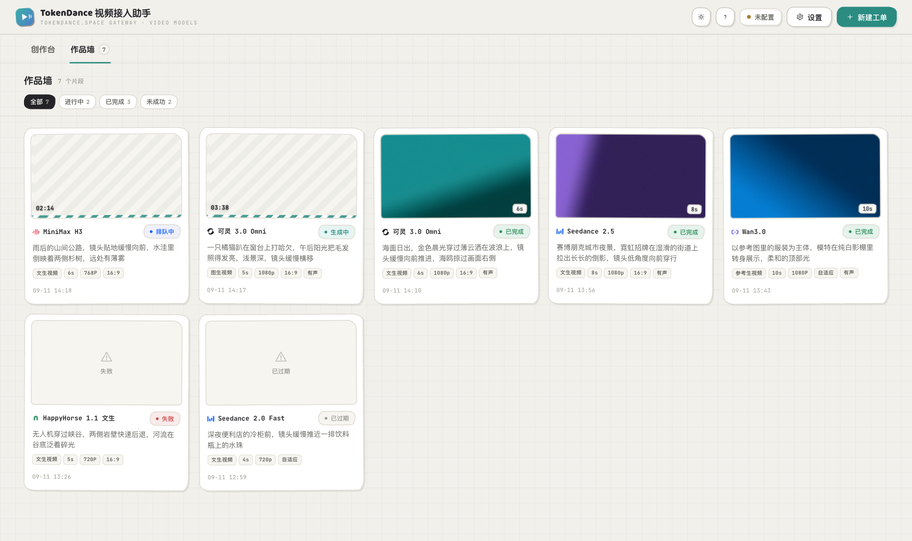

# TokenDance 视频接入助手 · VideoStudio

**v0.2.1** · 跑在本机的视频生成 Playground

一个接入 [词元跳动 TokenDance](https://tokendance.space/) 统一模型网关的本地视频创作控制台。一个 API Key，把原本要手写 API 请求的创作过程，变成选模型 → 填参数 → 出片 → 落盘，点点鼠标就完事。多段视频并行生成，每段独立选择模型与参数，完成后自动下载到本地，随时回看。

### v0.2.1 · 健壮性修复版

0.2.0 发布后做的"看不见的角落"修复，都是长尾场景。完整修复清单见底部 [v0.2.1 修复说明](#v021-修复说明)：

- **不再留孤儿视频**：删除任务时若视频还在后台下载中，会先标记取消、下载完自动删 `.part`，不会在 `videos/` 留下几 MB 到几百 MB 的无主文件
- **不再"以为在等授权"**：一键授权进行中关闭设置弹窗的路径被堵死（关闭按钮与遮罩都禁用），避免静默取消授权
- **网关半开不再永久挂起**：所有 fetch 都加超时（submit 30s / query 15s / 测试连接 5s / 同步模型 8s）
- **不再阻塞主线程**：视频下载改流式 + `.part` 临时文件；图片上传硬上限 8MB（避免大图 base64 后塞进 POST 卡住主线程）
- **新增 `/api/health` 端点**：版本、PID、运行时长、任务数、是否配 Key、模型目录来源——排查问题一查就知道
- **SSE 合并**按 id 走，避免覆盖你刚编辑但还没上传的本地修改
- **空地址计数持久化**：网关先标 succeeded 还没给视频地址时，跨重启不再无限轮询
- **CSP 收紧**：去掉 `style-src 'unsafe-inline'`，`textarea` 初始值改用 DOM property 设置

它本质上是一个**协议转换控制台**：填表单 → 组装成各模型的 API 请求 → 跟踪状态 → 下载结果，仅此而已。

> **定位声明**：本项目是社区自发的**非官方** Playground，与词元跳动官方无隶属关系；模型能力、价格、可用性以[官方平台](https://tokendance.space/)为准。


---

## 截屏速览

四张图看完主要界面，浅色为主、附一张深色：

| 视图 | 说明 |
| --- | --- |
|  | **创作台 · 选模型** — 按厂商分组的模型选择器，时长范围、单价、限时折扣、能力标签一目了然 |
|  | **创作台 · 配参数（深色）** — 选定模型后展开的完整配置区：生成方式 / 提示词 / 时长 / 分辨率 / 画面比例 / 有声视频，右侧实时算预估费用 |
|  | **作品墙** — 提交出去的片段按宫格铺开，卡片用视频首帧当封面；生成中的卡片是流光骨架加已用时长，顶部按状态一键过滤 |
|  | **首次打开** — 还没有工单时的欢迎页，所有模型族在走马灯里循环 |

> 主题在顶栏一键切换：**夜间 / 日间 / 跟随系统**，选择记忆在本机。

---

## 目录

- [下载（双击即用）](#下载双击即用无需安装任何环境)
- [首次打开必读](#首次打开必读)
- [创作流程（4 步出片）](#创作流程4-步出片)
- [功能特性](#功能特性)
- [它为什么这么简](#它为什么这么简)
- [你的数据](#你的数据)
- [已知约束](#已知约束)
- [从源码运行](#从源码运行)
- [打包（开发者向）](#打包开发者向)
- [技术说明：桌面版是怎么来的](#技术说明桌面版是怎么来的)
- [v0.2.1 修复说明](#v021-修复说明)
- [反馈与吐槽](#反馈与吐槽)
- [开源授权](#开源授权)

---

## 下载（双击即用，无需安装任何环境）

到 [Releases](https://github.com/HankGuo/video-studio/releases) 下载对应平台的包：

| 平台 | 下载 | 首次打开 |
| --- | --- | --- |
| **macOS（Apple 芯片）** | [VideoStudio-0.2.1-mac-arm64.zip](https://github.com/HankGuo/video-studio/releases/download/v0.2.1/VideoStudio-0.2.1-mac-arm64.zip) | 首次需执行一次 `xattr`，见下方 |
| **macOS（Intel）** | [VideoStudio-0.2.1-mac-x64.zip](https://github.com/HankGuo/video-studio/releases/download/v0.2.1/VideoStudio-0.2.1-mac-x64.zip) | 同上 |
| **Windows** | [VideoStudio-0.2.1-win-setup.exe](https://github.com/HankGuo/video-studio/releases/download/v0.2.1/VideoStudio-0.2.1-win-setup.exe)（安装向导）/ [绿色 zip](https://github.com/HankGuo/video-studio/releases/download/v0.2.1/VideoStudio-0.2.1-win-x64.zip) | SmartScreen 提示时点「更多信息 → 仍要运行」 |
| **Linux** | [VideoStudio-0.2.1-linux-x86_64.AppImage](https://github.com/HankGuo/video-studio/releases/download/v0.2.1/VideoStudio-0.2.1-linux-x86_64.AppImage)（[arm64 版](https://github.com/HankGuo/video-studio/releases/download/v0.2.1/VideoStudio-0.2.1-linux-arm64.AppImage)） | `chmod +x` 后双击运行 |

产物命名固定为 ASCII（`VideoStudio-${version}-${os}-${arch}.${ext}`），URL 在 Release 页里可以直接肉眼辨认。

---

## 首次打开必读

### macOS

包用的是 ad-hoc 签名，没有 Apple 开发者证书、也没做公证（notarization），所以系统一定会拦一次。把 app 拖进「应用程序」后，执行一次这条命令即可：

```bash
xattr -cr "/Applications/TokenDance 视频接入助手.app"
```

也可以走图形界面：双击后到「系统设置 → 隐私与安全性」，在底部找到被拦截的提示，点「仍要打开」。

> **不要再用「右键 → 打开」这个老办法。** 它只对「无法验证开发者」有效，对签名损坏的包无效；而且从 macOS 15 起 Apple 已逐步取消这个入口，在新系统上根本不会出现「打开」按钮。这个项目早期构建配置写错过（`identity: null` 会让 Electron 跳过签名、在包里留下失效的旧签名），在 macOS 上会被判定为「文件已损坏」并直接扔进废纸篓——那个问题从 v0.1.0 起已经修掉。

### Windows

包同样没有代码签名证书，首次运行 SmartScreen 会拦一次，点「更多信息 → 仍要运行」即可。安装向导版（`win-setup.exe`）会给桌面创建快捷方式，绿色 zip 版解压即用。

### Linux

AppImage 需要先 `chmod +x` 然后双击；首次运行会自动注册为可执行。如果系统用了 immutable 文件系统（如 Fedora Silverblue），可能需要先 `chmod` + 走 FUSE。

### 接入网关

首次启动会引导你填入[词元跳动平台](https://tokendance.space/)的 API Key——在设置里点「一键授权」，浏览器确认后自动回写，全程 PKCE 安全流程，授权码只在本机 127.0.0.1 上交换，不经第三方。也可以直接粘贴 API Key（仅保存在本机数据目录）。

---

## 创作流程（4 步出片）

1. **打开应用** → 设置里完成「一键授权」或粘贴 API Key → 点「测试连接」确认后保存
2. **点「新建工单」** → 在模型选择器里挑一个（表单会自动收敛到该模型支持的范围：分辨率档位、时长范围、是否支持图生视频、是否按 token 计费、是否限时折扣……全在列表上）
3. **配置参数** → 写提示词、选生成方式（文生视频 / 图生视频 / 多模态参考 / 视频编辑，按模型能力自动收敛）、调时长、画质、画面比例；编辑器底部按当前模型 / 画质 / 时长实时算预估费用
4. **点「开始生成」** → 创作台随即空出，可以接着开下一张；切到「作品墙」跟踪排队与生成进度，1–3 分钟后视频自动下载到本地，点开卡片即可播放

---

## 功能特性

### 创作
- **全量视频模型一网打尽**：按厂商分组的可视化模型选择器，官方品牌标识、能力标签、单价、限时折扣一目了然
- **四种生成方式**：文生视频 / 图生视频（首帧、首尾帧）/ 多模态参考生视频（参考图 + 参考视频 + 参考音频）/ 视频编辑，按模型能力自动收敛可用选项
- **多段并行生成**：提交出去的片段各自独立排队生成，模型、生成方式、时长、画质、画面比例互不影响
- **创作台 / 作品墙双面板**：创作台一次只配一段——选模型、填提示词、调参数，提交后回到起点再开下一张工单
- **作品墙**：已提交的片段按宫格铺开，卡片用视频首帧当封面，生成中是流光骨架加已用时长；点开卡片弹层播放
- **费用预估**：编辑器底部按当前模型 / 画质 / 时长实时计算预估费用，提交前心里有数
- **本地素材直传**：首帧与参考图支持直接选择本地图片，也可以粘贴公开可访问的 URL
- **状态自动跟踪**：提交后自动轮询，排队中 / 生成中 / 已完成实时刷新；完成后视频自动落盘本地，点开卡片即可播放
- **作品状态筛选**：全部 / 进行中 / 已完成 / 未成功一键过滤，带实时计数

### 体验
- **深色 / 日间 / 跟随系统三种主题**，顶栏一键切换，选择记忆在本机
- **新手引导遮罩**：首次启动四步聚光灯导览（连接网关 → 新建工单 → 创作台配置 → 作品墙），顶栏「?」随时重放
- **快捷键**：新建工单（⌘N / Ctrl+N）、设置（⌘, / Ctrl+,）

### 设置
- **一键授权（OAuth + PKCE）**：浏览器里点确认，API Key 自动回写到本机，全程不经第三方服务器
- **测试连接**：填完 Key 立刻 ping 一下网关，确认能通再保存
- **检查更新**：设置页底部一键对照 GitHub Releases 查新版，给出**当前平台对应**的下载链接、文件大小与 release notes；自动按 mac-arm64 / mac-x64 / win-setup / win-x64 / linux-x86_64 / linux-arm64 匹配到具体 asset。**仅做"查 + 跳下载页"，不自动下载安装**，用户拿到包自己决定装不装。开发态（`npm start`）跑源码时会在旁边打"开发态"徽标提醒

### 模型目录
- 模型目录内置在应用里（`main/models.js`），每次启动还会匿名拉取网关的公开模型清单与内置目录合并，**新模型上架即刻可用，无需升级应用**

---

## 它为什么这么简

这个项目不做画布、时间线、轨道剪辑，只把"选模型 → 填参数 → 出片"这一条链路做顺：让你用最低成本试遍各个模型、对比效果、攒下素材，剪辑合成交给专业的剪辑软件去做。功能不铺开，每个模型的能力边界和实际计费反而能做得更准。

---

## 你的数据

简单不等于不放心——**你的数据永远是你的**：

- **API Key 仅保存在你本机**，不会同步到任何服务器
- **素材与生成的视频不出本机一步**（素材只在提交任务时发送给你自己配置的网关）
- 应用没有服务器端、没有账号体系、没有遥测上报
- 本地服务仅监听 `127.0.0.1`，连局域网都访问不到
- 全部代码开源，可逐行审计验证

数据落盘位置（可用环境变量 `VIDEO_STUDIO_USER_DATA` 整体覆盖）：

| 平台 | 配置与视频 |
| --- | --- |
| macOS | `~/Library/Application Support/video-studio` |
| Windows | `%APPDATA%\video-studio` |
| Linux | `~/.config/video-studio` |

---

## 已知约束

| 项 | 上限 / 默认 | 触发后的行为 |
| --- | --- | --- |
| 单张本地图片上传 | **8 MB** | 服务端在读 body 时直接 reject，提示"图片过大，请压缩到 8MB 以内" |
| 提交请求超时 | 30 秒 | 网关半开（TCP 已建但不返）时 abort 并提示"网关请求超时（30s）" |
| 轮询请求超时 | 15 秒 | 同上，自动重试 |
| 测试连接超时 | 5 秒 | 探测时不能让用户等半分钟 |
| 视频下载超时 | 5 分钟 | 超时后写入 `downloadError`，状态回 succeeded，作品卡上点"重新下载"即可 |
| 单实例 | 唯一 | 重复打开会聚焦已有窗口，端口 `8970` 被占用 = 已有实例在跑，自动接过去 |
| 健康检查 | `/api/health` | 暴露 `version / pid / uptimeSec / taskCount / hasApiKey / models.source`，出问题想反馈时直接 curl 一下这个端点贴出来 |

> **为什么图片只让到 8MB**：上传只是把本地图片转 base64 塞进 POST body。base64 后体积再涨 33%，4K 原图会瞬间把主线程阻塞几秒并占用几十 MB 内存——常见视频截帧场景 2MB 完全够用。真的需要更大素材，请用 `refUrl` 模式走图床 URL。

---

## 从源码运行

唯一前置依赖是 **Node.js 18 或更高版本**（[下载地址](https://nodejs.org/)）。运行时**零第三方依赖、零构建步骤**，`npm install` 只是为了打安装包。

```bash
git clone https://github.com/HankGuo/video-studio.git
cd video-studio
npm start
```

启动后浏览器会自动打开 `http://127.0.0.1:8970`，用完在终端按 `Ctrl+C` 结束。不想碰终端的话，双击启动器效果一样：macOS 用 `start.command`，Windows 用 `start.bat`，Linux 用 `start.sh`。

端口被占用时可以换：`VIDEO_STUDIO_PORT=9000 npm start`。重复启动不会开重复的服务——已有实例在跑时，再次启动只会帮你多开一个标签页。

数据目录可通过 `VIDEO_STUDIO_USER_DATA=/path/to/dir npm start` 整体覆盖，便于多环境隔离。

---

## 打包（开发者向）

`npm install` 装上 `electron` + `electron-builder`（仅 devDependencies），然后：

```bash
npm test              # 接口自测
npm run pack:mac      # 打 macOS 包（arm64 + x64，zip 格式，ad-hoc 签名）
npm run pack:win      # 打 Windows 包（NSIS 安装向导 + 绿色 zip，x64）
npm run pack:linux    # 打 Linux 包（AppImage，x64 + arm64）
```

一台 macOS 机器可以交叉打出三平台产物。详细配置见 `electron-builder.yml`，其中：

- **产物名固定 ASCII** ——`VideoStudio-${version}-${os}-${arch}.${ext}`，避免下载 URL 被百分号编码成一长串
- **macOS 签名策略** ——`identity: "-"`（ad-hoc）配合 `hardenedRuntime: false`，避免 library validation 拦截 Electron 自带的库签名
- **NSIS 配置** ——`oneClick: false` + 允许改安装目录，比一键安装更适合小白

> 国内网络下 Electron 的二进制走 GitHub CDN（`objects.githubusercontent.com`）经常连不上，打包会以 `RequestError` / `The server aborted pending request` 失败。挂上镜像重试即可：
> `ELECTRON_MIRROR=https://npmmirror.com/mirrors/electron/ npm run pack:mac`

打包脚本在 Release 流水线里可加 `--publish always` 把产物推到 GitHub Releases（设置好 `GH_TOKEN` 即可），配合"检查更新"按钮形成完整闭环。

---

## 技术说明：桌面版是怎么来的

桌面版是一个 ~70 行的 Electron 薄壳（`desktop/main.js`），职责只有两件：起本地服务、开一个**没有地址栏、没有导航、没有菜单栏**的独立窗口指过去。壳里没有 IPC、没有 preload，窗口与内核之间走的就是 `127.0.0.1` 上的普通 HTTP/SSE——**和浏览器版是同一份代码，不会分叉**。

所以"桌面版"本质上是一个友好的"浏览器模式 + 任务栏图标 + 启动器"。这也意味着：所有功能（OAuth 回调、媒体流式输出、SSE 任务推送、设置 API、检查更新……）在 `npm start` 浏览器模式与桌面模式下行为完全一致，差异只在外观和首次打开体验。

仓库根目录的 `package.json` 的 `main` 字段保持 `server.js` 不变；打包时 `electron-builder.yml` 的 `extraMetadata.main: desktop/main.js` 覆盖入口为 Electron 壳。

---

## v0.2.1 修复说明

v0.2.0 主面板改成"创作台 / 作品墙"双面板后我自己又跑了一轮长尾场景测试，把 P0～P2 共 11 个问题一锅端了。详细列表：

| ID | 严重度 | 现象 | 修法 |
| --- | --- | --- | --- |
| P0-1 | 紧急 | 删除任务时若视频还在后台下载中，会留下几 MB 到几百 MB 的孤儿文件 | `remove` 给进行中的下载打 `_aborted` 标志，`_download` 完成时识别后自己删 `.part` |
| P0-2 | 紧急 | 首次启动点一键授权，授权中误关设置弹窗 → OAuth 静默取消 + 弹出新手引导 | 授权中关闭按钮 disabled、遮罩加 `.oauth-locked` 类，遮罩点击不响应 |
| P1-1 | 高 | 大视频下载用 `arrayBuffer()` 全量加载到内存，100MB+ 会 OOM | 改 `pipe` 流式落盘到 `.part` 临时文件，写完再原子 rename |
| P1-2 | 高 | 所有 fetch 没超时，网关半开（TCP 已建但不返）会永久挂起 | 统一 `requestJson` 包装 `AbortController`，submit 30s / query 15s / 测试 5s / 同步 8s |
| P1-3 | 高 | 40MB 上限大图经 base64 后塞进 POST body 阻塞主线程 | 上传硬上限 8MB（10MB base64 后体积可接受） |
| P1-4 | 中 | SSE 全量 `state.tasks = list` 替换，会覆盖刚 scheduleSave 的本地编辑 | 改为按 id 合并 + 删除服务端已不存在的 |
| P1-5 | 中 | 网关先标 succeeded 但没给视频地址时，`_emptyResults` 不持久化 → 重启后无限轮询 | 改用 `noUrlPolls` 字段（无下划线）让 `_public` 序列化自然带过去 |
| P2-1 | 低 | `pickAndUpload` 重新绑定 resolve/reject 的时序在快速操作下会吞 onchange | 监听 `focus` 注册到 `input.click()` 之前，单一 settle 函数 |
| P2-2 | 低 | `textarea` 初始 prompt 用 innerHTML 注入转义后内容，未来重构易踩 | 渲染时留空，渲染完成后用 `.value` property 注入 |
| P2-3 | 低 | CSP 里有 `style-src 'unsafe-inline'`，实际上未用 inline style | 去掉 `unsafe-inline` |
| P2-6 | 低 | 「开始生成」按钮失败行为和 `Cmd+Enter` 不一致，前者只 toast 不切回编辑器 | 统一：失败也 `loadIntoStudio` 回编辑器 |

另增：

- `GET /api/health` — 版本、PID、运行时长、任务数、Key 状态、模型目录来源
- `npm test` 测试用例从 32 个扩到 34 个，新增覆盖 /api/health 与 8MB 上传上限

---

## 反馈与吐槽

- 有问题、有想法、用得不爽 → 欢迎到 [Issues](https://github.com/HankGuo/video-studio/issues) 里直接说，吐槽也欢迎
- 企业或团队如需私有化部署、功能定制或商业支持 → **superai@agent.qq.com**

---

## 🧩 Hank 的 AI 工具矩阵

VideoStudio 是 Hank 个人 / 小团队工作流中**AI 视频创作**这一环。完整矩阵：

| 项目 | 角色 | 状态 |
|---|---|---|
| 🎬 **video-studio**（本仓库） | AI 视频创作工作流 | v0.2.x · 持续迭代 |
| 🧠 [**agent-matrix**](https://github.com/HankGuo/agent-matrix) | Agent 注册与派单 | v0.x · 内测中 |
| 🤝 [**open-meetup**](https://github.com/HankGuo/open-meetup) | 实时协作与分享 | v0.x · 稳定 |
| 🌐 [**webppt**](https://github.com/HankGuo/webppt) | 内容展示与沉淀 | 在线运行 |

> 公众号「**算力白肉**」会同步更新实战案例与产品决策记录。

---

## 📄 License

本项目以 [MIT License](LICENSE) 开源。

**商业使用完全自由**，保留版权与许可声明即可。如需定制开发、长期支持、API 接入、商务合作，请联系：`superai@agent.qq.com`

---

## 特别鸣谢

本项目构建于 [词元跳动 TokenDance](https://tokendance.space/) 之上——为接入 AI 模型的开发者打造的统一模型 API 网关：多协议兼容、智能路由、统一计费、容错降级，秉承「让每位 AI 创造者，少走一步弯路」的理念。在此致以诚挚谢意。

---

## 关注博主「算力白肉」

一个很懒的博主：年更、月更、不定期更。配套公众号文章：[《你的 API Key 是不是又在吃灰？》](https://mp.weixin.qq.com/s/DZIaSGb60VXe2NdTmChWiQ)，欢迎阅读、点赞、转发。


