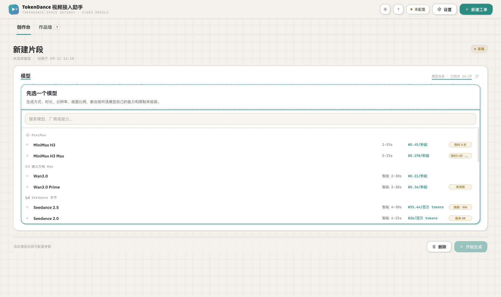
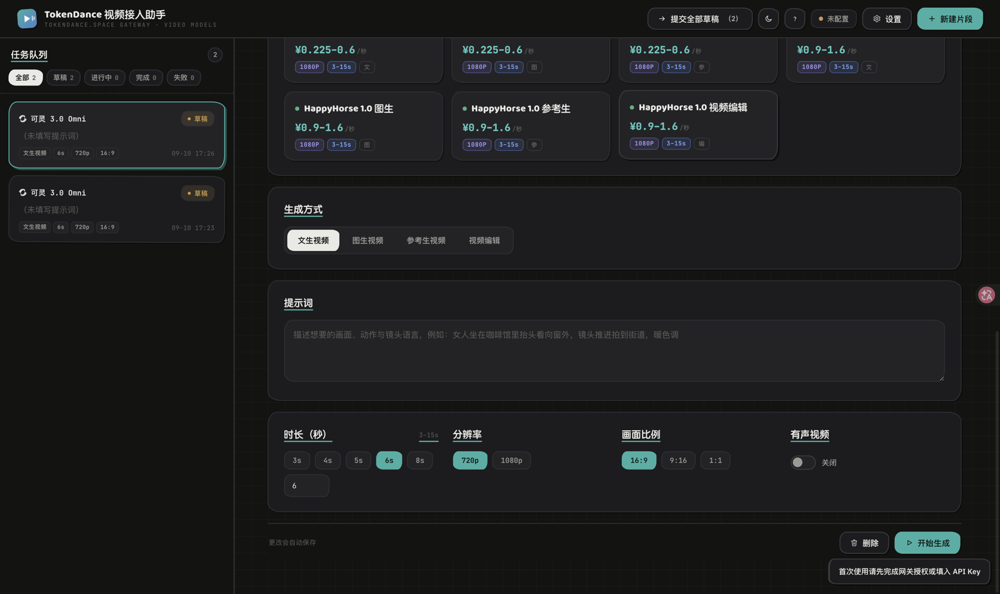
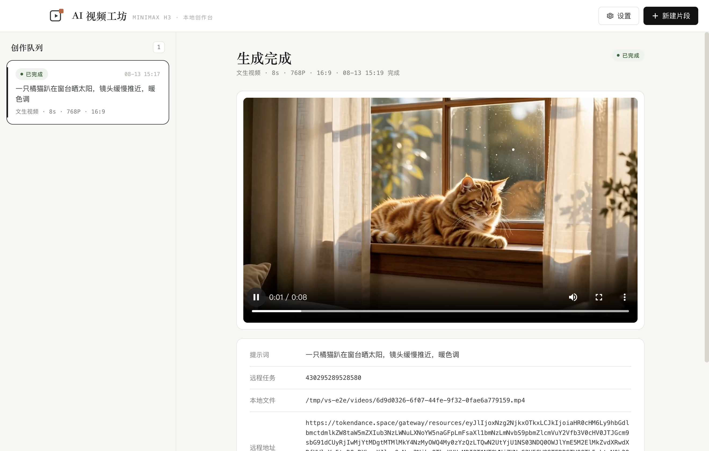

# AI 视频工坊 VideoStudio

一款运行在 macOS 上的本地 AI 视频创作工具。基于 **MiniMax H3** 视频生成模型，经 **词元跳动 TokenDance** 统一模型网关接入，把原本需要手写 API 请求的创作过程，变成看得见、点得动的可视化体验：多段视频并行生成，每段独立配置，完成后自动下载到本地，随时回看。



## 功能特性

- **三种生成方式**：文生视频 / 图生视频（首帧、首尾帧）/ 参考生视频（参考图 + 参考视频 + 参考音频自由组合）
- **多片段并行**：一次性排布多段视频，每段的生成方式、时长、画质、画面比例完全独立，互不干扰
- **本地素材直传**：首帧与参考图支持直接选择本地图片（自动转为 base64 提交），也可以粘贴 URL
- **状态自动跟踪**：提交后自动轮询，排队中 / 生成中 / 已完成一目了然
- **视频自动落盘**：生成结果自动下载到本地（远程地址 24 小时后失效，本地文件永久保留）
- **全局设置**：接入点与 API Key 可视化配置，支持一键测试连通性，本地保存
- **历史保留**：全部片段与配置本地持久化，重启不丢；中断的任务重启后自动续传





## 下载与安装

1. 前往 [Releases 页面](https://github.com/HankGuo/video-studio/releases) 下载最新版安装包（当前版本 [v1.0.0](https://github.com/HankGuo/video-studio/releases/tag/v1.0.0)，文件 `VideoStudio-1.0.0-arm64.dmg`，Apple Silicon）。
2. 打开 DMG，把 VideoStudio 拖入「应用程序」文件夹。
3. 首次打开如提示"无法验证开发者"：在「应用程序」中右键应用图标 →「打开」即可（应用未做付费签名，源码完全公开，可放心自查）。
4. 首次启动会自动引导你进入「设置」：填入你在词元跳动平台的 API Key，点击「测试连接」确认后保存。

## 使用说明

1. 点击右上角「新建片段」，选择生成方式，填写提示词，配置时长（6 / 8 / 10 秒或自定义）、画质（768P / 2K）与画面比例。
2. 配置自动保存。可以连续新建多段，每段独立配置。
3. 点击「开始生成」提交单段，或点顶部「提交全部草稿」一次性提交。
4. 等待 1–3 分钟，生成完成后视频自动下载到本地，直接点击播放；也可以在 Finder 中查看或导出。

数据存放位置：`~/Library/Application Support/video-studio/`（设置 `settings.json`、任务 `tasks.json`、视频 `videos/`）。

## 技术栈

- **Electron**：应用壳与主进程，负责任务队列、状态轮询、视频下载与本地持久化
- **原生 HTML / CSS / JS** 渲染层：零框架、零构建，浅色编辑部风格界面
- **MiniMax H3（minimax-h3）**：通用全模态视频生成模型
- **词元跳动统一模型网关**：MiniMax V2 异步任务协议（提交 → 轮询 → 取回）

## 特别鸣谢

本项目整套技术能力构建于以下两个平台之上，在此致以诚挚谢意。

### 词元跳动 TokenDance —— 统一模型 API 网关

[词元跳动](https://tokendance.space/) 是为接入 AI 模型的开发者打造的统一模型 API 网关，秉承"让每位 AI 创造者，少走一步弯路"的理念：

- **多协议兼容**：原生支持 OpenAI / Claude / Gemini 协议，覆盖文本、图像、视频、语音生成，切换 Base URL 即可接入，零迁移成本
- **智能路由**：根据模型名称自动路由至对应供应商，一个入口，无需关心底层调度
- **统一计费**：跨供应商统一 Token 消耗统计与账单，告别多平台分别充值的混乱
- **容错降级**：同一模型支持多供应商端点自动切换，保障服务持续可用
- **模型丰富**：接入 MiniMax、通义千问、Kimi、智谱、DeepSeek 等国内头部模型，持续扩展中

### MiniMax H3 —— 通用全模态生成模型

[MiniMax H3](https://www.minimaxi.com/blog/minimax-h3) 是 MiniMax 于 2026 年 8 月发布的通用全模态生成模型，具备对文本、图像、视频、声音组成的多模态上下文的统一理解能力，可输出具备原生双声道的音视频，最高支持 15s、2K 分辨率：

- **商用级生成能力**：在指令遵循、文字与品牌信息呈现、V2V Motion Transfer（视频到视频动作迁移）等方面表现出色，广泛适用于广告、品牌、电商、产品设计、UI/UX、游戏等商业场景
- **行业最优性价比**：2K 分辨率下每秒价格不到主流模型的 1/3，768P 分辨率为主流模型 720P 价格的 1/2
- **开放与自主**：模型在设计初期即考虑多款国产芯片兼容性，并计划开放模型权重，推动开源社区发展
- **技术自研**：Contextual Omni Representation、H3-VAE、H3-Omni Transformer、In-context Regeneration 等多项核心技术支撑

### 限时免费福利

**截止今晚（2026 年 8 月 13 日）24:00 前，在词元跳动平台上调用 MiniMax H3 全部免费。** 零成本体验全模态视频生成的最佳窗口，感兴趣的读者请抓紧时间，先到先得。

### 致谢词

谨以此项目，向词元跳动与 MiniMax 致以敬意与感谢。一个以统一网关让模型接入化繁为简，一个以全模态模型把视频生成的能力与性价比推向新的高度——它们为中国 AI 乃至世界 AI 的发展做出了实实在在的贡献，也让像这样的个人创作工具得以诞生。

## 开源授权

本项目采用 [MIT License](LICENSE)，**商业使用完全开放**：欢迎二次开发，欢迎直接用于任何商业场景，修改、分发、再发布均不受限制。本项目为个人作品，不保证持续维护，大家拿走改就是了。

## 安全与隐私

本应用为纯本地工具：

- API Key 仅保存在你本机的应用数据目录（`settings.json`），不会上传到你的接入点以外的任何服务器
- 无任何遥测、统计与上报行为
- 全部源代码公开，可逐行审计——开源版本不内置任何密钥，不必担心自己的 API Key 因使用本应用而泄露

## 本地开发与测试

```bash
git clone https://github.com/HankGuo/video-studio.git
cd video-studio

npm install
npm start          # 开发模式运行
npm run pack:dmg   # 打包 DMG 安装包

# 端到端测试（驱动真实界面、真实调用 API，请自备 Key）
VIDEO_STUDIO_TEST_KEY=sk-xxx node test/e2e.js

# 打包产物冒烟测试
node test/smoke.js
```

## 致谢 Kimi Code

本项目从产品形态决策、架构设计、编码实现，到多轮真实 API 端到端测试、UI 走查与 DMG 打包交付，**全程由 [Kimi Code](https://www.kimi.com/) 独立完成**。感谢 Kimi 团队的出色工作，这本身就是一次"AI 造 AI 工具"的完整实践。

## 关注博主「算力白肉」

一个很懒的博主：年更、月更、不定期更。偶尔发发心得，偶尔发发广子，反正都是随意发挥。喜欢的可以关注一下。


