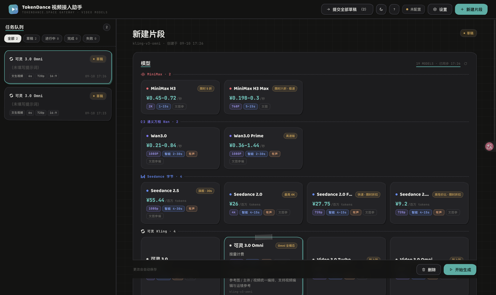
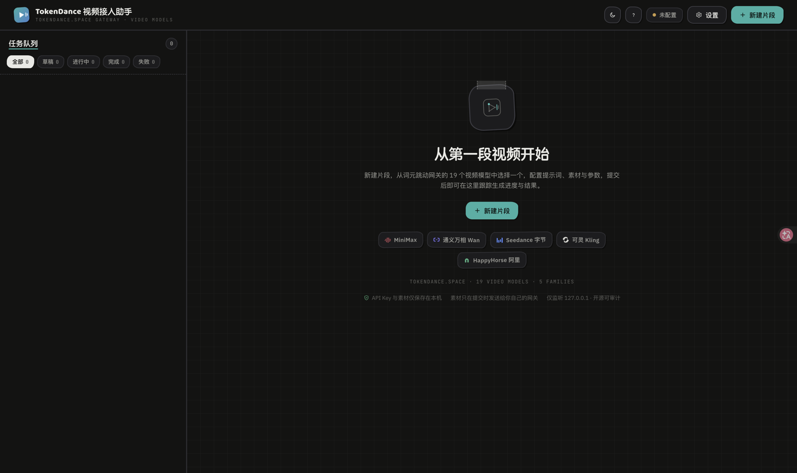

# TokenDance 视频接入助手 VideoStudio

一个跑在本机的 **视频生成 Playground**，接入 **[词元跳动 TokenDance](https://tokendance.space/) 统一模型网关上的全部视频生成模型**——MiniMax H3 / H3 Max、通义万相 Wan3.0 / Prime、Seedance 2.0 / 2.5 全系、可灵 Kling 3.0 / Omni、HappyHorse 1.0 / 1.1 全系。一个 API Key，五种视频协议，把原本需要手写 API 请求的创作过程，变成看得见、点得动的可视化体验：多段视频并行生成，每段独立选择模型与参数，完成后自动下载到本地，随时回看。

它本质上是一个**协议转换控制台**：填表单 → 组装成各模型的 API 请求 → 跟踪状态 → 下载结果，仅此而已。

> **定位声明**：本项目是社区自发的**非官方** Playground，与词元跳动官方无隶属关系；模型能力、价格、可用性以[官方平台](https://tokendance.space/)为准。它不做账号、不经手中转、不碰你的数据——只是把官方网关的视频模型接口，变成一个看得见、点得动的本地工作台。


## 快速开始

唯一的前置依赖是 **Node.js 18 或更高版本**（[下载地址](https://nodejs.org/)）。除此之外零依赖、零安装、零构建。

```bash
git clone https://github.com/HankGuo/video-studio.git
cd video-studio
npm start
```

启动后浏览器会自动打开 `http://127.0.0.1:8970`，用完在终端按 `Ctrl+C` 结束即可。

不想碰终端的话，也可以**双击启动器**（效果完全一样）：

| 平台 | 双击这个文件 |
| --- | --- |
| macOS | `start.command` |
| Windows | `start.bat` |
| Linux | `start.sh` |

首次启动会自动引导你进入「设置」：填入你在[词元跳动平台](https://tokendance.space/)的 API Key（或点「一键授权」自动完成），点击「测试连接」确认后保存。

> 重复启动不会开重复的服务：如果已有实例在运行，再次启动只会帮你在浏览器里再开一个标签页。端口被别的程序占用时，可以用 `VIDEO_STUDIO_PORT=9000 npm start` 换端口。

## 为什么是本地 Web UI（v3 拆掉了 Electron）

v1/v2 用 Electron 套了个壳。回头看，这并没有解决任何实际问题——它只是让应用"看起来像一个 Mac 应用"，代价却是：

- 两百多兆的运行时，换一个协议转换控制台；
- 只能方便地打 macOS 安装包，反而**丢掉了跨平台能力**；
- 签名、公证、DMG 打包……全是和"生成视频"无关的负担。

这个项目说到底就是个本地服务加一个页面，和各家 AI CLI 提供的本地 Web UI 是同一个形态。所以 v3 回归简单：**一个零依赖的 Node 小服务器 + 一个浏览器页面**，一行命令或双击一个文件就能启动，macOS / Windows / Linux 通吃，源码也从"Electron 主进程 + 预加载脚本 + 渲染层"塌缩成人人能读懂的几百行普通 Node 代码。

## 为什么没做画布和时间线（大道至简）

经常有"视频工作台"会做画布、时间线、轨道剪辑。这个项目明确不做，原因有两个：

1. **开发时间受限**。这是个人业余项目，与其铺一堆半成品功能，不如把"选模型 → 填参数 → 出片"这一条链路打磨到顺手。
2. **回归 AI 使用的本质**。它就是个 Playground——定位就是一个简单的 Playground，只对接 TokenDance 的视频模型。它的价值是让你用最低成本试遍各个模型、对比效果、攒下素材；真正的剪辑合成，交给专业的剪辑软件去做。

功能边界即产品尊严：这个仓库里只会出现和「试模型、出片段」直接相关的能力。如果哪天真的需要画布和时间线，那应该是一个独立的新项目，而不是让这个 Playground 越长越大、越来越慢。

## 支持的模型

| 模型 | 生成方式 | 分辨率 | 时长 | 计费 |
| --- | --- | --- | --- | --- |
| MiniMax H3 | 文生 / 图生 / 参考生 | 768P · 2K | 1–15s | ¥0.45–0.72/秒 |
| MiniMax H3 Max（极速） | 文生 / 图生 | 480P · 768P | 5–15s | ¥0.198–0.3/秒 |
| Wan3.0 / Wan3.0 Prime | 文生 / 图生 / 参考 / 编辑 | 480P–1080P | 2–30s | ¥0.21–1.44/秒 |
| Seedance 2.5 | 文生 / 图生 / 参考 / 编辑 | 480p–1080p | 4–30s | 按输出 token |
| Seedance 2.0 / Fast / Mini | 文生 / 图生 / 参考 | 最高 4K（2.0） | 4–15s | 按输出 token |
| 可灵 3.0 | 文生 / 图生（首末帧） | 720p–4K | 3–15s | ¥0.48–2.4/秒 |
| 可灵 3.0 Omni | 文生 / 图生 / 参考 / 编辑 | 720p · 1080p | 3–15s | 见平台模型页 |
| HappyHorse 1.1（文/图/参考） | 对应单一模式 | 480P–1080P | 3–15s | ¥0.225–0.6/秒 |
| HappyHorse 1.0（文/图/参考/编辑） | 对应单一模式 | 720P · 1080P | 3–15s | ¥0.9–1.6/秒 |

模型目录内置在应用里（`main/models.js`），包含每个模型支持的生成方式、分辨率档位、时长范围、画面比例与单价，选择模型后表单自动收敛到该模型支持的范围。每次启动还会自动同步网关的最新模型清单，新模型上架即刻可用。

## 功能特性

- **新手引导遮罩**：首次启动自动播放四步聚光灯导览（连接网关 → 新建片段 → 配置提交 → 任务队列），一次看懂主流程；顶栏「?」随时重放
- **深色 / 日间 / 跟随系统三种主题**：顶栏一键切换，选择记忆在本机；手撕贴纸风 + 中性配色，默认深色工作台


- **全量视频模型一网打尽**：按厂商分组的可视化模型选择器，官方厂商标识、能力、单价、限时折扣一目了然
- **费用预估**：编辑器底部按当前模型 / 画质 / 时长实时计算预估费用，提交前心里有数
- **队列状态筛选**：全部 / 草稿 / 进行中 / 完成 / 失败一键过滤，带实时计数
- **网关状态灯**：顶栏常驻连接状态（已连接 / 未配置 / 连不通），点击直达设置
- **键盘快捷键**：`⌘/Ctrl+N` 新建片段，`⌘/Ctrl+⏎` 提交当前草稿，`⌘/Ctrl+,` 打开设置
- **四种生成方式**：文生视频 / 图生视频（首帧、首尾帧）/ 多模态参考生视频（参考图 + 参考视频 + 参考音频）/ 视频编辑，按模型能力自动可用
- **多片段并行**：一次性排布多段视频，每段的模型、生成方式、时长、画质、画面比例完全独立，互不干扰
- **本地素材直传**：首帧与参考图支持直接选择本地图片（上传后自动转为 base64 提交），也可以粘贴 URL
- **状态自动跟踪**：提交后自动轮询，排队中 / 生成中 / 已完成一目了然，界面实时推送刷新
- **视频自动落盘**：生成结果自动下载到本地（远程地址 24 小时后失效，本地文件永久保留），页面内直接播放
- **全局设置**：网关地址与 API Key 可视化配置，支持一键测试连通性，本地保存
- **历史保留**：全部片段与配置本地持久化，重启不丢；中断的任务重启后自动续传




## 使用说明

1. 点击右上角「新建片段」，在编辑器顶部选择模型（不同模型支持的生成方式、分辨率与时长不同，表单会自动适配）。
2. 选择生成方式，填写提示词，配置时长、画质与画面比例；参考生 / 编辑模式按要求添加素材。
3. 配置自动保存。可以连续新建多段，每段独立配置。
4. 点击「开始生成」提交单段，或点顶部「提交全部草稿」一次性提交。
5. 等待 1–3 分钟，生成完成后视频自动下载到本地，直接点击播放；也可以在文件管理器中查看或导出。

数据存放位置（设置 `settings.json`、任务 `tasks.json`、视频 `videos/`、上传素材 `uploads/`）：

| 平台 | 目录 |
| --- | --- |
| macOS | `~/Library/Application Support/video-studio/` |
| Windows | `%APPDATA%\video-studio\` |
| Linux | `~/.config/video-studio/` |

> 从 v1/v2（Electron 版）升级的用户：macOS 上数据目录不变，旧任务与设置自动迁移，开箱即用。

## 一键授权是如何工作的（无需中心化平台）

设置里的「一键授权」走词元跳动的 [API Key 授权流程](https://tokendance.space/docs/api-key-oauth)（Authorization Code + PKCE S256）：

1. 本机服务器监听一个 `127.0.0.1` 随机端口，然后拉起你的默认浏览器打开授权页
2. 你在授权页确认 Key 的名称、额度与有效期
3. 平台把一次性 `code` 重定向回本机回调，本机用只有它自己知道的 `code_verifier` 交换出 API Key，立即写入本机 `settings.json`

整条链路只经过「你的浏览器 ↔ 词元跳动 ↔ 你本机的 127.0.0.1」，**不需要任何中心化中转平台**——这正是该授权协议为桌面客户端和本机 CLI 设计的标准用法（loopback 回调支持任意端口），每个用户在自己电脑上运行、各自完成授权，互不相关。

### 关于 APP URL（申请接入时填什么）

授权参数里的 `app_url` **不是回调地址**，它是平台侧「应用归因的唯一要素」：一个写入新 Key 的稳定标识 URL，后续该 Key 的调用会自动继承这个归因。文档明确要求它必须是稳定 URL，不能填随机回调端口。

本项目填的是仓库主页 `https://github.com/HankGuo/video-studio`——分布式部署的所有实例共用这一个标识即可，这正是它的设计意图。正式申请（目前限量开放）时建议：

| 申请项 | 填写建议 |
| --- | --- |
| 应用名称 / `key_name` | TokenDance 视频接入助手 (VideoStudio) |
| `app_url` | `https://github.com/HankGuo/video-studio`（如有专属产品页，换产品页即可） |
| 回调模式 | localhost/loopback 任意端口（`http://127.0.0.1:<随机端口>/callback`） |
| PKCE | S256 |

预留配置项（环境变量，无需改代码）：

| 变量 | 作用 | 默认值 |
| --- | --- | --- |
| `VIDEO_STUDIO_APP_URL` | 覆盖授权用的 App URL | 仓库主页 |
| `VIDEO_STUDIO_KEY_NAME` | 覆盖授权页展示的应用名称 | TokenDance 视频接入助手 (VideoStudio) |

### 已设计未实现的预留项

- **Headless 授权**：SSH / 远程开发机 / 容器里跑本服务时，loopback 回调到不了你的浏览器。协议支持省略 `callback_url`、由用户手动复制一次性 code 回来交换，后续版本会在设置里加一个「粘贴授权码」入口（协议细节已确认，见官方文档 Headless 一节）。当前版本在无法自动拉起浏览器时会把授权链接打印到终端，手动打开即可完成授权
- **恢复引导**：网关调用失败时响应头可能携带 `TokenDance-Recovery-Action`（`top_up_balance` 充值 / `reauthorize_api_key` 重新授权 / `api_key_quota` 额度刷新），当前版本会把对应的恢复提示直接附在错误信息里展示；后续版本会把它升级成带动作按钮的界面引导

## 技术栈

- **零依赖 Node.js 服务器**（`server.js`，仅标准库，Node 18+）：托管页面、JSON API、SSE 状态推送、任务队列、视频下载与本地持久化；只监听 `127.0.0.1` 并校验 Host 头（防 DNS rebinding），媒体输出与文件操作严格限制在数据目录内
- **原生 HTML / CSS / JS** 界面：零框架、零构建，手撕贴纸风 × 中性专业工作台（Baloo 2 + IBM Plex Sans + JetBrains Mono 本地字体），面向 13 英寸及以上 PC 屏幕流体伸缩
- **词元跳动统一模型网关**，五种视频协议适配（`main/protocols.js`）：
  - `minimax:video_generation_v2`（MiniMax H3 系列）
  - `seedance:generations`（Ark 异步任务，Seedance 全系）
  - `wan3:video-synthesis`（阿里百炼异步任务，Wan3.0 系列）
  - `happyhorse:video-synthesis`（DashScope 异步任务，HappyHorse 全系）
  - `kling:text2video / image2video / omni-video`（可灵 3.0 与 Omni）

## 特别鸣谢

本项目整套技术能力构建于 [词元跳动 TokenDance](https://tokendance.space/) 之上，在此致以诚挚谢意。

词元跳动是为接入 AI 模型的开发者打造的统一模型 API 网关，秉承"让每位 AI 创造者，少走一步弯路"的理念：

- **多协议兼容**：原生支持 OpenAI / Claude / Gemini 协议，覆盖文本、图像、视频、语音生成，切换 Base URL 即可接入，零迁移成本
- **智能路由**：根据模型名称自动路由至对应供应商，一个入口，无需关心底层调度
- **统一计费**：跨供应商统一 Token 消耗统计与账单，告别多平台分别充值的混乱
- **容错降级**：同一模型支持多供应商端点自动切换，保障服务持续可用
- **模型丰富**：接入 MiniMax、通义千问、Kimi、智谱、DeepSeek、Seedance、可灵等国内头部模型，持续扩展中

## 开源授权

本项目采用 [MIT License](LICENSE)，**商业使用完全开放**：欢迎二次开发，欢迎直接用于任何商业场景，修改、分发、再发布均不受限制。本项目为个人作品，不保证持续维护，大家拿走改就是了。

## 我们的承诺

这些承诺不靠自觉，靠架构：应用**没有服务器端、没有账号体系、没有任何上报通道**，你的密钥、素材和作品在物理上就没有离开本机的路径。全部代码零依赖、约两千行，欢迎逐行审计验证。

**隐私安全承诺（绝对本地）**

- API Key 仅保存在你本机的数据目录（`settings.json`），除你自己配置的网关接入点外，不会发送给任何服务器
- 素材图片仅在提交生成任务时以 base64 形式发送给你自己配置的网关接入点，此外不出本机一步
- 无账号体系、无遥测、无统计、无上报；本地服务只监听 `127.0.0.1` 并校验请求 Host 头（防 DNS rebinding），`/media` 媒体输出与「打开 / 显示文件」操作被严格限制在应用数据目录内——连局域网都访问不到它
- 开源版本不内置任何密钥，OAuth 授权全程 PKCE（S256）保护，一次性授权码即使被截获也无法换出 Key

**素材与作品保留承诺**

- 你上传的每一张图片、生成的每一段视频，都只保存在你自己的电脑上，我们没有任何服务器能碰到它们
- 应用永远不会主动清理、清空你的素材与作品——只有你自己点击「删除片段」时，对应的本地视频文件才会被删除
- 升级版本不会重置或清空你的数据；即使卸载应用，数据目录也会原样保留，你的作品始终由你自己掌控
- 远端生成的视频地址 24 小时后失效，但下载到本地的文件永久保留，随时回看、随时导出

**私有化部署与代码保护**

- 企业或团队需要私有化部署、内网隔离运行、功能定制或商业支持，请联系：**superai@agent.qq.com**
- 私有化部署版本可按需对前端代码做混淆加固交付，避免界面代码被反编译或直接复制盗用；开源版本则保持源码完全公开，便于审计与二次开发——两个版本互不冲突

## 本地开发与测试

```bash
git clone https://github.com/HankGuo/video-studio.git
cd video-studio

npm start        # 启动工作台
npm test         # 服务器冒烟测试（API / 上传 / 媒体流，不消耗真实额度）

# 调试技巧
VIDEO_STUDIO_NO_OPEN=1 npm start            # 启动但不自动打开浏览器
VIDEO_STUDIO_PORT=9000 npm start            # 换端口
VIDEO_STUDIO_USER_DATA=/tmp/vs npm start    # 隔离数据目录
```

## 致谢 WorkBuddy × Kimi

本项目 v1 由 [WorkBuddy](https://www.codebuddy.cn/work/) 搭载 Kimi K3 模型独立完成，v2 全量模型扩展、v3 去 Electron 化改造由 Kimi Code 完成。作者只负责提需求、喝茶和验收。这本身就是一次"AI 造 AI 工具"的完整实践。

## 关注博主「算力白肉」

一个很懒的博主：年更、月更、不定期更。偶尔发发心得，偶尔发发广子，反正都是随意发挥。喜欢的可以关注一下。

配套公众号文章（本项目 v1 的完整故事）：[《你的 API Key 是不是又在吃灰？》](https://mp.weixin.qq.com/s/DZIaSGb60VXe2NdTmChWiQ)，欢迎阅读、点赞、转发，希望大家支持。


